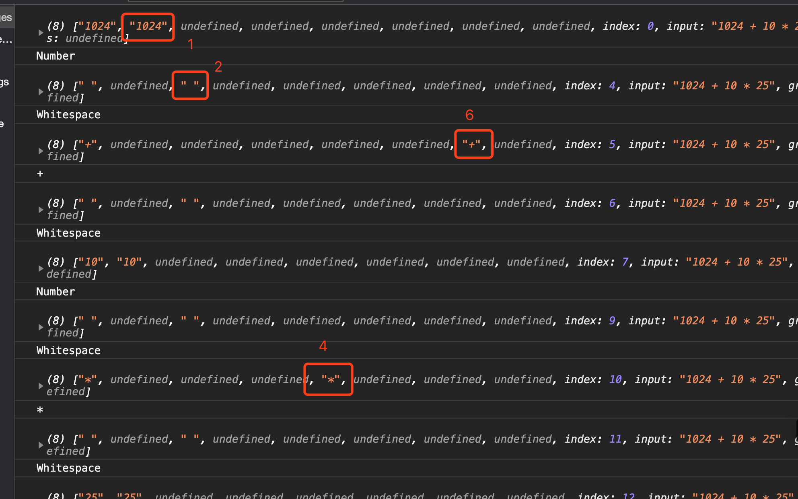

# 学习笔记

> 这里会记录一些上课的心得感想

## 心得记录

### 01.使用Regex正则表达式来做词法分析的小技巧

#### **使用|来做多次匹配**

在词法分析的正则中，使用|分割的多个匹配段，可以被Regex对象多次exec,每一次exec只会向后匹配一个|里面的东西，然后返回的result数组里，对应数组下标的位置就是正则表达式中|匹配段的位置，非常方便取到对应的匹配项，对照下面的对应截图理解：

``` javascript 

var dictionary = ["Number","Whitespace","LineTerminator","*","/","+","-"];

//                  1           2           3             4   5   6   7

```



### 02.关于如何进行表达式求值的思考

在编写[简单的表达式求值demp](./evaluateExpression.html)的时候，发现本次课程里的四则运算表达式都没有包含括号等情况，在实际的语言的编译和解释器中，除了四则运算，还有各种复杂的操作，比如：

- 定义变量，函数
- 变量赋值
- 函数调用
- control flow等

遇到这些复杂的场景，怎么根据词法、语法分析的结果，去做语言的执行，也是一个很大的课题，这方面不知道老师有没有什么学习资源和路径可以指点一下？

#### **使用|来做多次匹配**


## 作业(**必做**)

### 01-完成课程页面底下练习，提交至课程页面

`已完成`

> 顺手实现了一个根据表达式进行求值的demo,[点击这里](./evaluateExpression.html)
