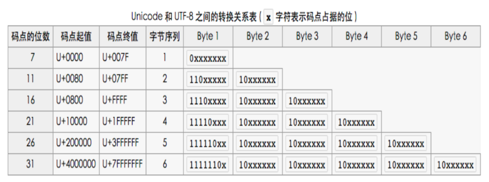
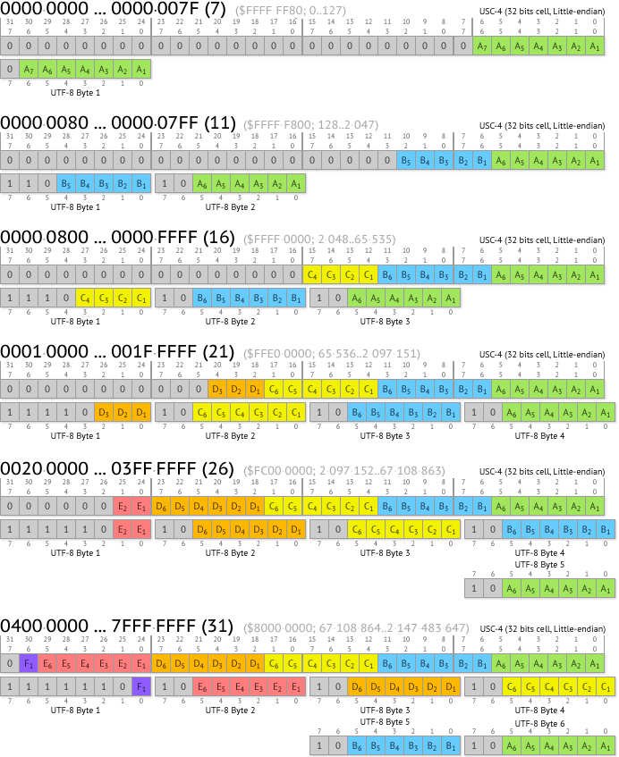

# 学习笔记

> 这里会记录一些上课的心得感想

## 心得记录

### 01.形式语言分类（乔姆斯基谱系）

- 0型：无限制文法
- 1型：上下文相关文法
- 2型：上下文无关文法
- 3型：正则文法

### 02.BNF中常用的元字符的定义如下

- ::= ：是“被定义为”的意思；示例：字符串 ::= 用引号包围的字符序列，表示 字符串 就是 用引号包围的字符序列
- "..."：终结符，即引号中的字符序列本身，并非指代其它字。而终结符双引号 " 用 double_quote 用来表示；示例：函数调用 ::= 名字 "()" 表示 函数的调用 是 由 名字 加上左右括号字符 () 组成；
- double_quote ：代表终结符 双引号 "； 示例：字符串 ::= double_quote ... double_quote，表示 字符串 是由被字符 " 包围的字符序列组成；
在双引号外的字代表着语法部分；示例：基本类型 ::= 字符串 | 数字 | 布尔，表示 字符串 或 数字 或 布尔 都是 基本类型，但 字符串、数字、布尔 具体是什么，由- 其它 规则定义；
- <...>：必选项；示例：名字 ::= [姓] <名> 表示 名字 中的 名 是必须要有的，但 姓 是可有可无的，即：姓 名 是 名字，名 也是 名字；
- [...]：可选，可有可无；示例：名字 ::= [姓] <名> 表示 名字 中的 名 是必须要有的，但 姓 是可有可无的，即：姓 名 是 名字，名 也是 名字；
- {...}：重复，0 或 任意次重复；示例：AB ::= "a" {"b"}，表示 AB 是由 一个 a 后面跟上任意数量（包括0个）个 b 组成，如 a、a b、a bb、a bbb
- (...)：分组，用来控制表达式的优先级；示例：AX ::= "a" ("m"|"n")，表示 AX 是由 一个 a 后面跟上 m 或 n 组成；
- |：替换，即 或 的意思；示例：布尔 ::= "true" | "false"，表示 true 或 false 都是 布尔；
- ...：表示各种列举或省略的代码片断；示例：a...z 表示 从 a 到 z 的字符，"..." 表示 由 双引号 " 包围起来的任意字符；
- 斜体字: 参数，在其它地方有解释；

### 03.关于UTF8编码

如上图，想要对string进行utf8编码，只需要遵循上面表格的规则，将每个字符的码点找到，然后按照上表进行查找属于哪一个范围，然后进行编码即可

下面的图对UTF-8的说明可能更加直观：

### 04.关于狗咬人的设计问题

 首先，狗咬人这个设计，我们需要考虑的是几个方面：

- 这个动作是哪个对象发起
- 这个行为，改变了哪些对象的内部状态
- 我们不应该让狗和人之间，发生直接的依赖

但是对于winter课堂上说的：`bite方法因为没有对狗的状态产生改变，所以不应该定义在Dog类上`，这个我还是表示有一些怀疑的:

- 改变自身状态的方法，可以定义在"人"身上
- 从语义上说，”咬“的动作就是发生在狗身上，只不过对”人”的状态造成了改变
- 如果我们不希望影响对象的内聚性，可以在狗的`bite`方法里调用人的`hurtBy`来解决

## 作业(**必做**)

### 01-完成第 2、4、8、10、11 节课上练习，提交至课程页面底下练习

`已完成`
