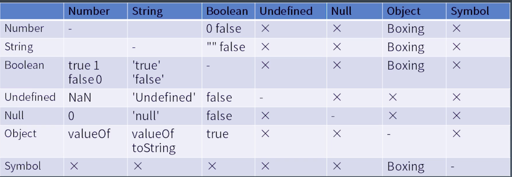
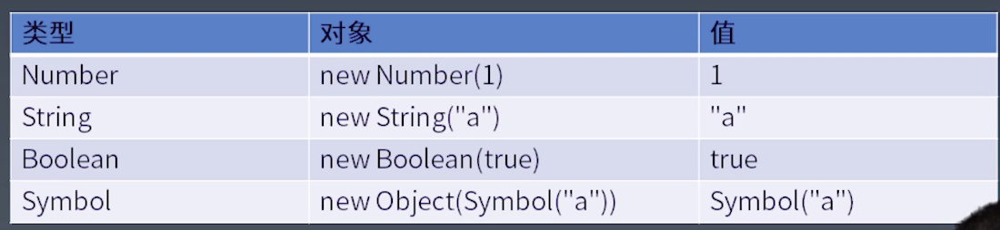

# 学习笔记

> 这里会记录一些上课的心得感想

## 心得记录

### 01.js的类型转换规则



### 02.js的类型装箱(基本类型转为Object)



### 03.Number类型值和Number类对象的区别

首先看一段代码:

```javascript

let a=1;
console.log(typeof a); // number
console.log(a.toString()); // 1

let a2 = new Number(1);
console.log(typeof a2); // object
console.log(a2.toString()); // 1

a == a2; // true

a === a2 // false

```

上面的例子中，变量`a`是一个Number类型的值，这里从它的`typeof`可以看出来。那么问题来了：`为什么一个字面量值，可以使用.号来调用本应该是对象的toString方法呢`。

这是因为，在做.号运算之前，js引擎自动对`number`类型的`1`做了`自动装箱`，产生了一个`Number对象`，所以就可以调用对象的`toString`了。

### 06.try语句里的return，不会打断finally的执行

这是js里唯一一种return语句也无法打断执行的结构

## 作业(**必做**)

### 01-完成第 2、4、8、10、11 节课上练习，提交至课程页面底下练习

`已完成`
