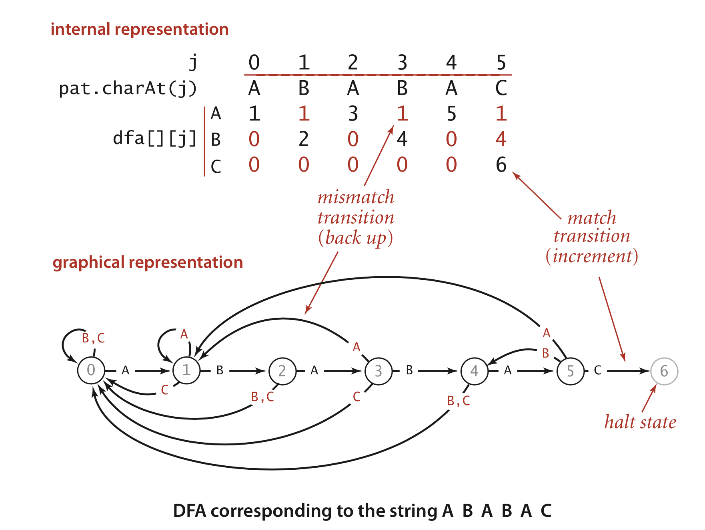

# 学习笔记

> 这里会记录一些上课的心得感想

## 心得记录

### 01.有限状态机的特点

- 每一个状态机都是一个独立的机器，可以独立的进行计算、存储、输出
- 所有状态机，接受的输入是一致的
- 状态机的每一个机器本身不应该有状态，应该是纯函数(无副作用)
- 每一个机器是知道下一个状态的，这里面分2种
  - Moore型状态机：每个机器都确定的知道下一个状态是什么（`和输入无关`）
  - Mealy型状态机：每个机器`根据输入来决定`下一个状态是什么
  
### 02.状态机的实现要点

- 遇到处理重复字符串的时候，可能对于同样的字符需要设计多个状态函数去处理。
- 当一个状态函数接收的参数自己无法处理的时候，可以在return的时候调用其他状态函数去处理，`避免输入丢失的情况` 

### 03.如何用有限状态机来实现KMP算法

- kmp 算法有两种实现方式，一种是基于`确定有限状态机的 DFM`(deterministic finite-state automaton)，另一种是`基于部分匹配表 PMT`(Partial Match Table) 的。

- PMT 的思路更容易理解一点，但是 DFM 则是一种更”优雅“的方式。

> 之前课程里KMP的解法实际就是基于分配表来计算next的方法

下面是《算法》中的对字符串 ABABAC 作为 pattern 的状态机图示。



对这两个图做一个简单的解释，上方的是一个矩阵，下方是一个图表，他们表达的是同一个有限状态机，只是形式不同。这两张图表达的就是`ABABAC`进行匹配的状态机。所有的数字表示的都是状态，而这个状态数字可以理解成当前已经成功匹配了几个字符，比如状态`4`表示已经成功匹配到了`ABAB`才进入状态`4`。下方图表的箭头则表示状态的转移，注意每个箭头上都有一个字母，表示这个转移是因为这个字母的输入。以状态`3`为例，我们此时已经成功匹配到了`ABA`三个字符，下面我们接受的输入有三种可能`ABC`，当接收`B`时，我们成功匹配进入状态`4`，当接收`A`时，我们回到了状态`1`，当我们接收`C`时回到状态`0`。我们的状态机接收两个参数，一个是当前状态，一个是输入，得到的结果就是应该转移的状态。在矩阵图中，`j`是当前所处的状态，`pat.charAt(j)`表示`pattern`在当前要匹配的字符，纵向的`dfa[][j]`则表示输入，中间的矩阵表示要转移到的状态，比如矩阵中位置`[0,0]`的`1`表示，在状态`0`接收输入`A`，状态转移到`1`。

> 这里需要注意，我们的状态机只和`pattern`有关，就是不管我们要进行匹配的字符串是什么，只要我们的`pattern`不变，状态机就不变，举个例子就是不管待匹配的字符串是`ababababaaacaba`还是`abafabafagaba`，只要`pattern`是`ABABAC`，状态机就不变，所以在分析状态机的时候我们只需要分析在 pattern 中出现的字符。
### 02.toString方法使用模板字符串的时候，为什么换行只需要`\r`即可

因为模板字符串在编写的时候，换行就相当于插入了`\n`

### 04.关于模板字符串构造http请求的容易出错的地方

刚开始我的`client.js`发的数据，server怎么都收不到，`Request.toString`代码如下：

``` javascript


//client.js
  toString(){
    return `${this.method} ${this.path} HTTP/1.1\r
    ${Object.keys(this.headers).map(key =>`${key}:${this.headers[key]}`).join("\r\n")}\r
    \r
    ${this.bodyText}`
  }

```
经过调试，发现模板字符串会把反引号之间的所有字符都转化为字符串，其中包括了不可见的vscode自动添加的tab等，所以导致了发送出去的请求不符合http协议标准。

而我们的`server.js`是直接使用的`http`模块进行数据获取，所以自然收不到数据了
## 作业(**必做**)
### 01-完成第3,4,5,7,9，11，12,13,14节课上练习，提交至课程页面底下练习

`已完成`