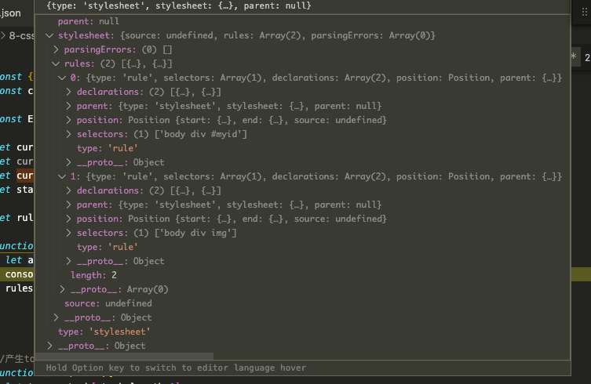

# 学习笔记

> 这里会记录一些上课的心得感想

## 心得记录

### 01.HTML解析的状态机资料

可参考[WHATWG的标准](https://html.spec.whatwg.org/multipage/parsing.html#tokenization),里面有定义`80`种状态：

``` txt

13.2.5.1 Data state
13.2.5.2 RCDATA state
13.2.5.3 RAWTEXT state
13.2.5.4 Script data state
13.2.5.5 PLAINTEXT state
13.2.5.6 Tag open state
13.2.5.7 End tag open state
13.2.5.8 Tag name state
13.2.5.9 RCDATA less-than sign state
13.2.5.10 RCDATA end tag open state
13.2.5.11 RCDATA end tag name state
13.2.5.12 RAWTEXT less-than sign state
13.2.5.13 RAWTEXT end tag open state
13.2.5.14 RAWTEXT end tag name state
13.2.5.15 Script data less-than sign state
13.2.5.16 Script data end tag open state
13.2.5.17 Script data end tag name state
13.2.5.18 Script data escape start state
13.2.5.19 Script data escape start dash state
13.2.5.20 Script data escaped state
13.2.5.21 Script data escaped dash state
13.2.5.22 Script data escaped dash dash state
13.2.5.23 Script data escaped less-than sign state
13.2.5.24 Script data escaped end tag open state
13.2.5.25 Script data escaped end tag name state
13.2.5.26 Script data double escape start state
13.2.5.27 Script data double escaped state
13.2.5.28 Script data double escaped dash state
13.2.5.29 Script data double escaped dash dash state
13.2.5.30 Script data double escaped less-than sign state
13.2.5.31 Script data double escape end state
13.2.5.32 Before attribute name state
13.2.5.33 Attribute name state
13.2.5.34 After attribute name state
13.2.5.35 Before attribute value state
13.2.5.36 Attribute value (double-quoted) state
13.2.5.37 Attribute value (single-quoted) state
13.2.5.38 Attribute value (unquoted) state
13.2.5.39 After attribute value (quoted) state
13.2.5.40 Self-closing start tag state
13.2.5.41 Bogus comment state
13.2.5.42 Markup declaration open state
13.2.5.43 Comment start state
13.2.5.44 Comment start dash state
13.2.5.45 Comment state
13.2.5.46 Comment less-than sign state
13.2.5.47 Comment less-than sign bang state
13.2.5.48 Comment less-than sign bang dash state
13.2.5.49 Comment less-than sign bang dash dash state
13.2.5.50 Comment end dash state
13.2.5.51 Comment end state
13.2.5.52 Comment end bang state
13.2.5.53 DOCTYPE state
13.2.5.54 Before DOCTYPE name state
13.2.5.55 DOCTYPE name state
13.2.5.56 After DOCTYPE name state
13.2.5.57 After DOCTYPE public keyword state
13.2.5.58 Before DOCTYPE public identifier state
13.2.5.59 DOCTYPE public identifier (double-quoted) state
13.2.5.60 DOCTYPE public identifier (single-quoted) state
13.2.5.61 After DOCTYPE public identifier state
13.2.5.62 Between DOCTYPE public and system identifiers state
13.2.5.63 After DOCTYPE system keyword state
13.2.5.64 Before DOCTYPE system identifier state
13.2.5.65 DOCTYPE system identifier (double-quoted) state
13.2.5.66 DOCTYPE system identifier (single-quoted) state
13.2.5.67 After DOCTYPE system identifier state
13.2.5.68 Bogus DOCTYPE state
13.2.5.69 CDATA section state
13.2.5.70 CDATA section bracket state
13.2.5.71 CDATA section end state
13.2.5.72 Character reference state
13.2.5.73 Named character reference state
13.2.5.74 Ambiguous ampersand state
13.2.5.75 Numeric character reference state
13.2.5.76 Hexadecimal character reference start state
13.2.5.77 Decimal character reference start state
13.2.5.78 Hexadecimal character reference state
13.2.5.79 Decimal character reference state
13.2.5.80 Numeric character reference end state

```

但是其实我们在实现简单的浏览器的时候，只需要选取实现里面的部分状态就可以了

### 02.可以进行CSS语法解析的库

使用下面的库进行CSS语法解析。

``` bash

npm install css

```
举例：在作业中我返回了这样的style标签：

``` html
<html lang="en">
<head>
  <style>
    body div #myid {
      width:100px;
      background-color:$ff5000;
    }
    body div img {
      width:30px;
      background-color:$ff1111;
    }
  </style>
</head>
</html>

```

那么node.js中使用`css`模块进行解析之后，得到的ast截图：


### 03.关于DOM树的构建

简单的toyBrowser的DOM树的构建，直接使用栈结构就可以，其代码主要写在`emit`方法里，也就是token被解析出来之后

## 作业(**必做**)
### 01-完成第12节课上练习，提交至课程页面底下练习

`已完成`

> 运行作业的步骤：
> - 先运行/server.js
> - 然后运行xxx/client.js(不同文件夹的client.js是一样的，只是parser不一样)
> - 不同的parser.js，完成度不同，最后一个parse.js最完整