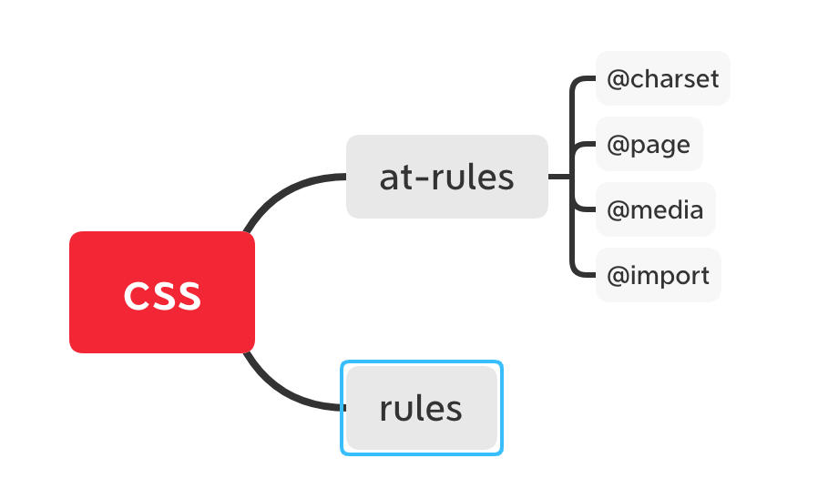
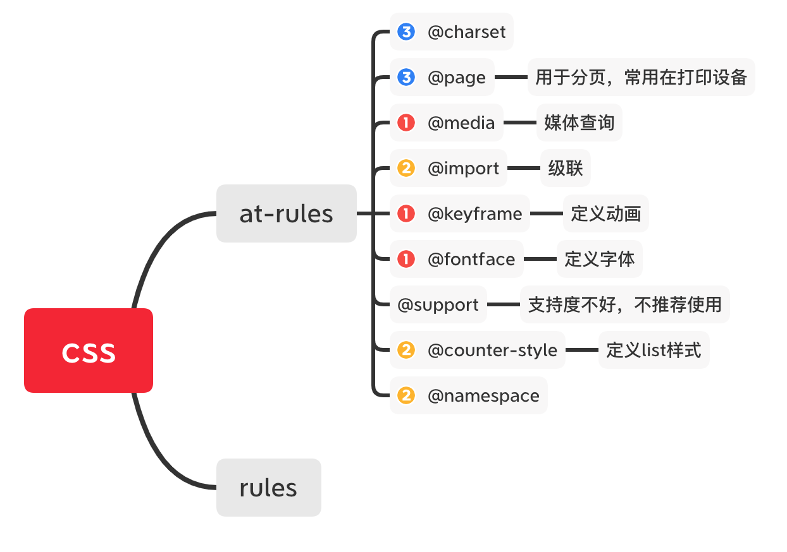
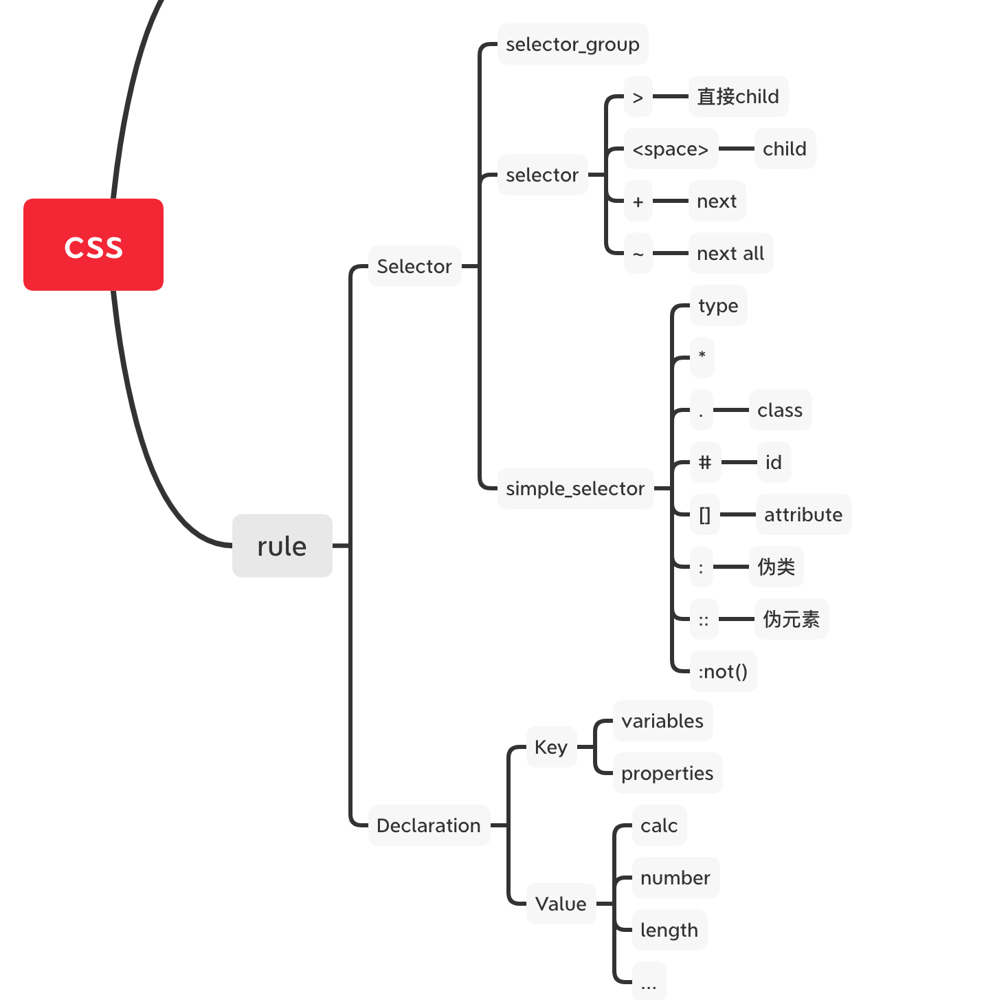
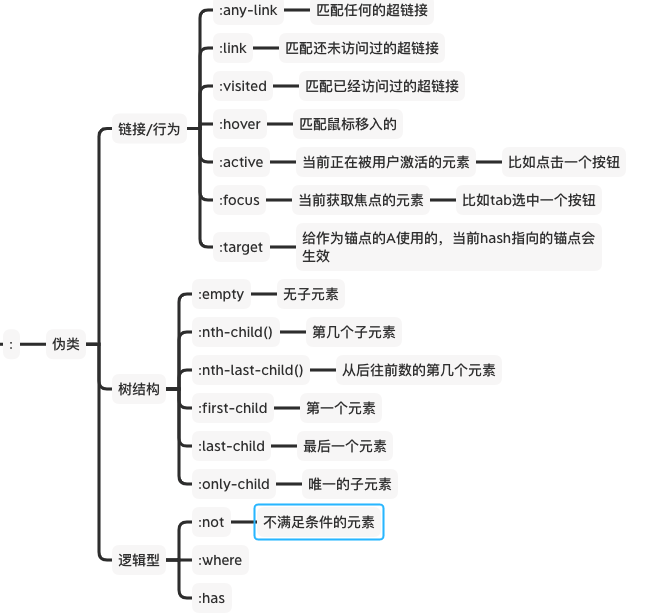

# 学习笔记

> 这里会记录一些上课的心得感想

## 心得记录

### 01.css2.1里面的基本知识结构



### 02.css中的at rules
对照课程的梳理，我加上了日常使用优先级标注


### 02.css中的rules



### 03.css中specificity的计算

参考[标准](https://www.w3.org/TR/selectors-3/#specificity):

```markdown

A selector's specificity is calculated as follows:

count the number of ID selectors in the selector (= a)
count the number of class selectors, attributes selectors, and pseudo-classes in the selector (= b)
count the number of type selectors and pseudo-elements in the selector (= c)
ignore the universal selector

```

CSS的优先级计算是计算一个`四元组`:按照从左到右的顺序依次计算：

- 是否inline样式
- class选择器，属性选择器，伪类
- 类型选择器，伪元素
- 忽略全局选择器(也就是*号)

如下图所示例子：

| selector      | inline | id  | class selectors, attributes selectors, and pseudo-classes | type selectors and pseudo-elements |
| ------------- | ------ | --- | --------------------------------------------------------- | ---------------------------------- |
| div div #id   | 0      | 1   | 0                                                         | 2                                  |
| div #id1 #id2 | 0      | 2   | 0                                                         | 1                                  |

### 04.伪类



## 作业(**必做**)
### 01-完成课上练习，提交至Github

`已完成`