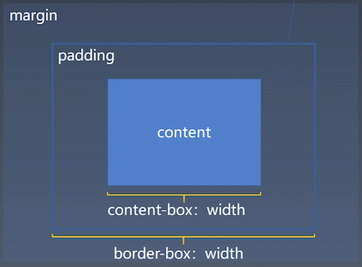
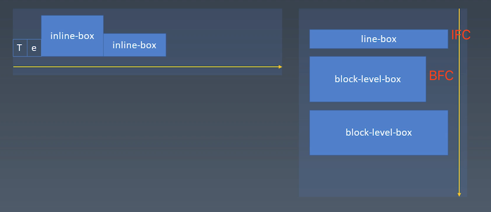
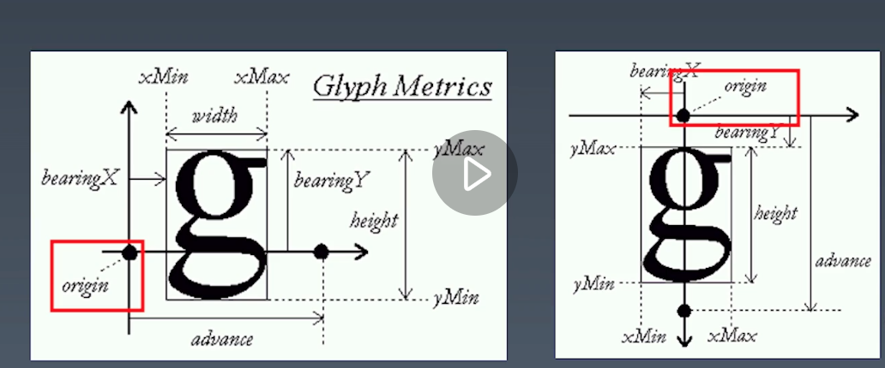
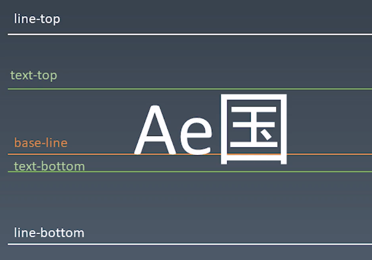

# 学习笔记

> 这里会记录一些上课的心得感想

## 心得记录  

### 01.css盒子模型

### 02.正常流

- BFC(Block Formatting Context)
  
  用来保存做block级盒排版时所需要的上下文信息
  
- IFC(Inline Formatting Context)
  
  用来保存做inline级盒排版时所需要的上下文信息

> 一般我们说`触发`BFC其实是不太准确的，应该叫`设立`BFC

### 03.字体是如何定义基线的
下面`文字中origin`部分就是基线位置的定义。

每一种字体除了要定义每个字的大小之外，还是需要定义基线的。

### 04.CSS的行模型

- 行内的盒子的baseline有几种情况
  - 无文字：则是其底缘
  - 有文字：取其文字的底缘

### 05.颜色的表示：RGB,HSL,HSV
## 作业(**必做**)
### 01-完成课上练习，提交至Github

`已完成`