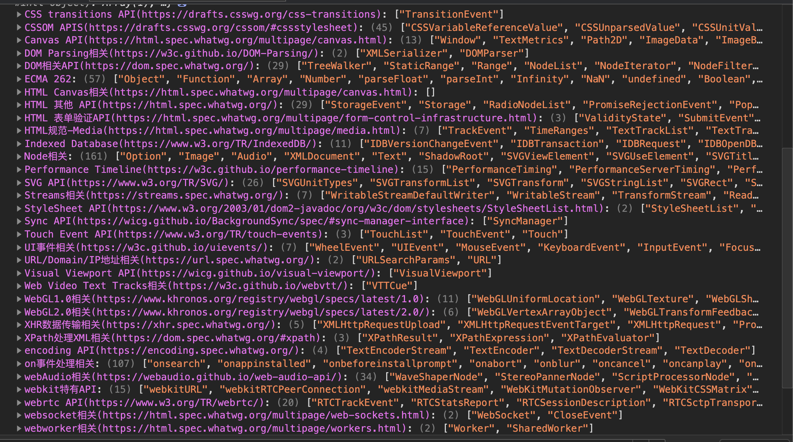

# 学习笔记

> 这里会记录一些上课的心得感想

## 心得记录  

### 01.compareDocumentPosition函数

比较两个节点中关系

### 02.addEventListener的第三个参数

- passive
  在移动端默认是true。如果想要阻止一些默认行为比如`scroll`,则应该记得设置为true
### 02.Range

Range可以选择文档的`一部分`，进行更精细化的操作
### 03.CSSOM

`document.stylesheets`:可以获得页面里加载的样式表，可以获取里面的rules和attribute

`getComputedStyle`:可以获取某个元素在渲染时的具体样式，可以实现一些特殊的功能

### 04.CSSOM view

- window.innerHeight/innerWidth
- window.devicePixelRatio
- getClientRects()
  - 获取元素生成的盒子（可能是多个）
- getBoundingClientRect()
  - 获取包裹元素的区域（多个盒子最终叠加的结果）
### 05.前端API的标准化组织

- khronos
  - WebGL
- ECMA
  - ECMAScript
- WHATWG
  - HTML
- W3C
  - 组织类型
    - CG:社区组  
    - WG:工作组
    - IG:兴趣租
  - webaudio

## 作业(**必做**)
### 01-完成课上练习，提交至Github

下面是我分类出来的APIS截图：

`已完成`