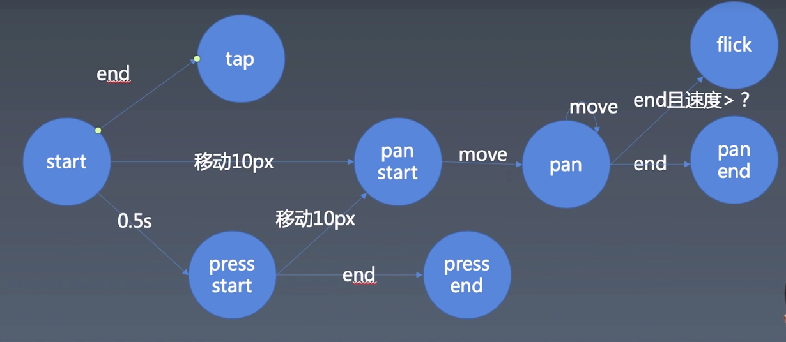

# 学习笔记

> 这里会记录一些上课的心得感想

## 心得记录  
### 01.动画模块的组成部分

- timeline

timeline的职责是管理时间，为动画的执行提供时间片。控制着时间的流逝、暂停等逻辑。

timeline的编写可以采用多种方式

- setInterval
- setTimeout(自循环)
- requestAnimationFrame(自循环) `推荐`
  - 使用cancelAnimationFrame可以取消之前创建的handler

### 02.三次贝塞尔曲线
目的是对动画的进程做计算，从而输出一个[0.1]之间的progress,影响动画的执行进度。

### 03.手势库的状态图

### 04.鼠标事件和触摸事件的比较

| 类别     | 鼠标事件                                        | 触摸事件                                  |
| -------- | ----------------------------------------------- | ----------------------------------------- |
| 触发事件 | mousedown,mousemove,mouseup                     | touchstart,touchmove,touchend,touchcancel |
| 区分按键 | mousedown：event.button,mousemove:event.buttons | touch.identifier                          |

## 作业(**必做**)
### 01-完成课上练习，提交至Github

`已完成`